# 2025: 18 Top-Tier B2B Contact Data LinkedIn Prospecting Tools You Must Know

Sales teams waste hours manually hunting for contact information—copying email addresses from websites, guessing phone number formats, and updating outdated CRM records. By the time you finally reach a prospect, competitors already made their pitch. B2B prospecting demands speed, but most tools either lack accuracy or cost too much for growing teams.

Modern LinkedIn prospecting tools solve this by instantly revealing verified email addresses and phone numbers directly on profiles. Whether you're an SDR hitting quota, a founder building pipeline, or a recruiter filling positions, the right contact finder eliminates busywork and connects you with decision-makers faster. From free Chrome extensions to enterprise platforms, these tools transform how you generate leads and build relationships.

---

## **[Kaspr](https://www.kaspr.io)**

All-in-one LinkedIn prospecting with 500M+ contact database and unlimited B2B emails under fair use policy.

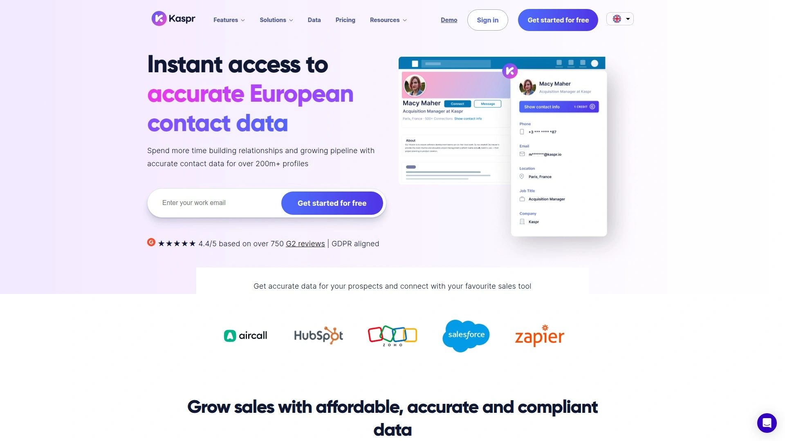

Kaspr delivers instant access to accurate European contact data for over 200 million profiles, positioning itself as the go-to solution for small sales teams, SDRs, founders, and recruiters who need reliable information without enterprise pricing. The platform combines a powerful LinkedIn Chrome Extension with a comprehensive web app for seamless prospecting across your workflow.

What makes Kaspr stand out is its generous free plan that actually delivers value—5 phone credits and 5 email credits monthly with full access to the Chrome Extension, API, and lead management features. This lets you test the platform thoroughly before committing. The real game-changer is unlimited B2B email addresses on paid plans (subject to fair use), eliminating the anxiety of burning through credits when building prospect lists.

The Chrome Extension works directly on LinkedIn and Sales Navigator, revealing contact details with one click as you browse profiles. You can instantly see verified phone numbers and email addresses, then save prospects to organized lead lists within the Kaspr dashboard. The data comes from over 150 sources with real-time verification, ensuring you're not wasting time on disconnected numbers or bounced emails.

Kaspr integrates seamlessly with your existing sales stack including HubSpot, Salesforce, Zoho, Aircall, and Zapier. This means contact data flows automatically into your CRM without manual exports or copy-pasting. The platform follows GDPR and CCPA compliance standards, critical for European operations and businesses serving international markets.

Setup takes minutes with zero onboarding required—install the extension, create an account, and start prospecting immediately. The dashboard provides centralized lead management where you can organize prospects, set up automations, and track outreach activities. For teams prioritizing ease of use, data accuracy, and affordable pricing, Kaspr removes the traditional barriers to professional-grade prospecting tools.

---

## **[Cognism](https://www.cognism.com)**

Diamond Data phone-verified mobile numbers with AI search and intent data powered by Bombora for targeted outreach.

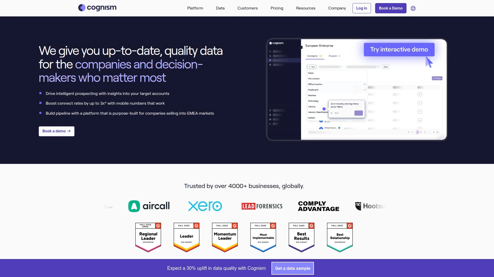

Cognism built their reputation on Diamond Data—phone-verified mobile numbers for B2B contacts that actually ring through to decision-makers. The Sales Companion browser extension integrates seamlessly with LinkedIn, allowing you to access company and contact details while browsing profiles. Unlike scraped data, Cognism's numbers are manually verified by humans, delivering significantly higher connect rates.

The platform provides two core products: Sales Companion Web App for accessing their vast database of contacts, companies, and buying signals, plus the Browser Extension for real-time data enrichment on LinkedIn and other platforms. Cognism AI Search uses ChatGPT-style text or voice prompts to find prospects, making complex boolean searches unnecessary—just describe who you're looking for in plain language.

Intent data powered by Bombora identifies companies actively researching topics relevant to your business, letting you prioritize prospects showing buyer signals. This combination of verified contacts plus intent data dramatically improves outreach timing. Cognism integrates with Salesforce, HubSpot, Outreach, and other sales engagement tools, allowing you to export data directly into existing workflows.

The platform excels at enriching CRM accounts and contact-level records, cleaning up databases while adding missing information. For enterprise sales teams and agencies requiring the highest data quality standards, Cognism justifies premium pricing through superior connect rates. The focus on international data makes it particularly valuable for businesses targeting European and global markets.

---

## **[Lusha](https://www.lusha.com)**

GDPR and CCPA compliant B2B platform with job change alerts and intent data for timely prospect engagement.

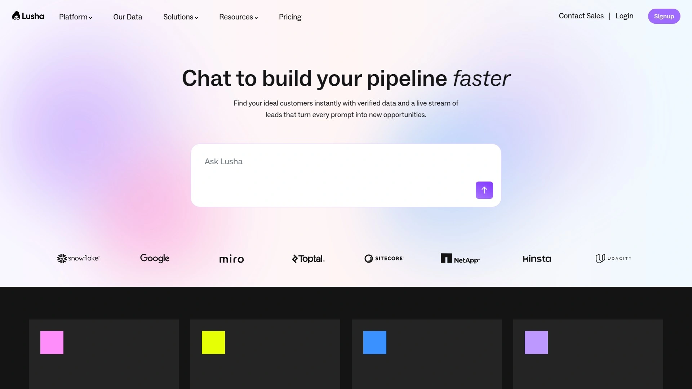

Lusha provides direct contact information for business professionals while maintaining strict data compliance standards. The platform offers GDPR and CCPA-compliant data collection methods, ensuring privacy and security for international operations. Lusha's LinkedIn Chrome Extension reveals emails and phone numbers as you browse, with over 4.3 million users trusting the platform globally.

The free plan includes 50 email and 5 phone credits annually—enough for testing but requiring upgrade for regular use. Pro plan starts at $36 per user monthly with 1,920 email credits and 480 phone credits annually. What sets Lusha apart is the job change filters and alerts, notifying you when prospects move to new positions where they might need your solution.

Intent data capabilities help identify companies actively researching relevant topics, prioritizing leads showing buying signals. Lusha enriches your CRM with up-to-date data, automatically filling gaps in contact records. The platform integrates smoothly with major CRM systems for seamless data flow.

Lusha works particularly well for SMBs looking to gain pipeline visibility and scale prospecting with one comprehensive tool. The combination of contact data, intent signals, and job change tracking provides multiple entry points for conversations. For businesses where compliance matters and timing is critical, Lusha delivers the data infrastructure needed for modern B2B sales.

---

## **[UpLead](https://www.uplead.com)**

Real-time email verification with advanced filtering by company size, revenue, technographics, and 50+ criteria.

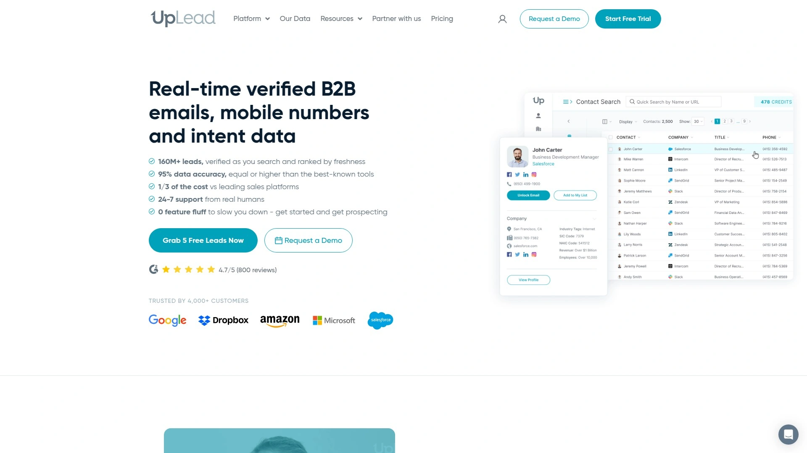

UpLead specializes in verified B2B contact data with real-time email verification ensuring accuracy before outreach. The platform provides comprehensive information including email addresses, phone numbers, and LinkedIn profiles for prospects matching your ideal customer profile. Advanced search filters let you target by company size, revenue, industry, location, job title, and technographic details.

The data enrichment feature enhances existing lead data with firmographic and technographic information, helping you understand prospects' business context and technology stack. This intelligence enables more personalized outreach that resonates with specific pain points. UpLead integrates with Salesforce, HubSpot, Pipedrive, and other major platforms.

The Chrome Extension finds contact details while browsing websites and social media, including LinkedIn. Over 50 filters including management level, department, and employee count provide precise targeting. UpLead offers a 7-day free trial, with the Essential plan at $99 monthly including 170 credits, verified emails, phone numbers, and CRM integration.

Real-time verification means you're not paying for bad data—UpLead only charges credits when email addresses are successfully verified. This accuracy-first approach reduces bounce rates and protects sender reputation. For B2B sales teams building targeted prospect lists and wanting to avoid wasted effort on incorrect information, UpLead provides reliable foundations for outreach campaigns.

---

## **[Wiza](https://wiza.co)**

Efficient transformation of LinkedIn and Sales Navigator searches into rich email contact databases with API access.

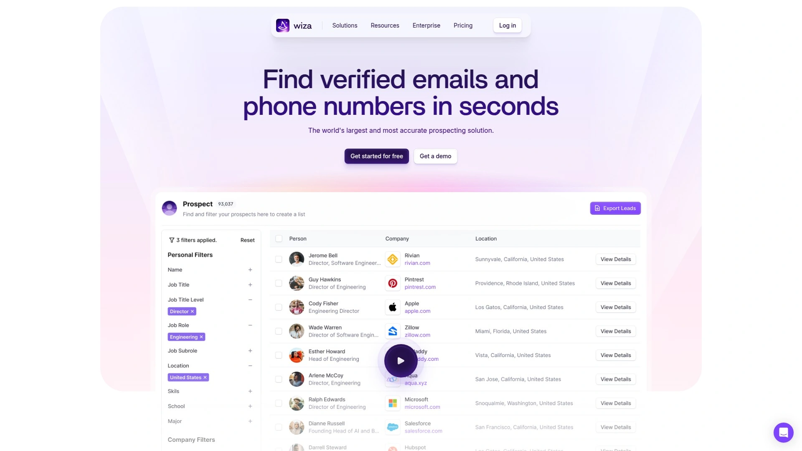

Wiza excels at converting LinkedIn search results into actionable contact lists quickly. The platform integrates directly with LinkedIn and Sales Navigator through their API, providing real-time data access without manual exports. You simply perform your LinkedIn search, then Wiza extracts verified email addresses and phone numbers for everyone in your results.

The free tier offers 20 emails and 5 phone numbers monthly at no cost—useful for occasional prospecting. Email tier at $99 monthly provides unlimited emails with $0.35 per phone number and 10,000 monthly export limit. Email plus Phone tier at $199 monthly includes unlimited emails and phone numbers with the same export cap.

Wiza creates email lists from LinkedIn searches efficiently, making it ideal for sales teams running targeted campaigns. The platform integrates with CRM systems for seamless data management, pushing contacts directly into your sales workflows. Real-time LinkedIn data access ensures information stays current rather than relying on stale databases.

Users consistently praise Wiza's accuracy—"Wiza has been a game changer for me/my team. Accurate data for the win." The platform works best when you already know your target audience and use LinkedIn's robust filters to find them. For teams wanting to convert LinkedIn research into outreach quickly without manual data entry, Wiza streamlines the entire process.

---

## **[Hunter.io](https://hunter.io)**

Domain-based email finder with multi-browser extension and company-wide email pattern detection for scalable prospecting.

Hunter focuses specifically on email discovery using company domains. Type a company name or website domain and Hunter generates verified email addresses for employees in seconds. The email-finding extension works on Firefox, Edge, and Chrome, collecting contact information from LinkedIn and company websites as you browse.

The contact database allows searching by company domain, revealing email patterns organizations use (firstname.lastname@company.com, first.last@company.com, etc.). This pattern recognition helps you construct valid email addresses even for contacts not in Hunter's database. Email address verification ensures you're using up-to-date data that won't bounce.

Customer intent data capabilities identify companies showing buying signals. Hunter's free plan includes 25 monthly searches, with Starter plan at $34 monthly for 500 searches plus optional $10 add-on for 100 extra credits. The platform integrates with email outreach tools, letting you find contacts and launch campaigns from one interface.

While Hunter focuses heavily on email and doesn't provide phone numbers, this specialization means exceptional email accuracy. Many sales teams use Hunter for email discovery then supplement with phone-specific tools as needed. For businesses prioritizing email outreach over cold calling, Hunter delivers targeted contact information at affordable prices with reliable verification.

---

## **[AeroLeads](https://aeroleads.com)**

B2B lead generation extracting verified emails and phone numbers with bulk prospecting and CRM export capabilities.

AeroLeads helps sales teams and recruiters find verified contact information quickly. The platform provides names, companies, email addresses, and phone numbers from LinkedIn, Crunchbase, and other sources. AeroLeads offers bulk prospecting capabilities, collecting multiple leads simultaneously through automation rather than one-by-one manual extraction.

Email verification ensures contacts are accurate before outreach, reducing bounce rates. The Chrome extension finds contact details while browsing websites and social media platforms. AeroLeads integrates directly with major CRM platforms and email marketing software, enabling seamless export of collected leads.

You can segment lists by job title—creating targeted lists like CSO emails or marketing director contacts. The browser plugin makes data extraction effortless as you research prospects across the web. Free trial available with paid plans starting at $39 per user monthly, positioning AeroLeads affordably for small to mid-size teams.

AeroLeads works well for outbound prospecting requiring both email and phone contact options. The bulk collection feature saves significant time when building large prospect lists from LinkedIn searches or company databases. For teams needing verified multi-channel contact data with straightforward CRM integration, AeroLeads provides practical functionality without overwhelming complexity.

---

## **[LeadFuze](https://www.leadfuze.com)**

AI-powered lead scoring with automated contact discovery and Sales Navigator integration for prioritized prospecting.

LeadFuze automates lead generation by finding prospects' email addresses and contact details through real-time verification using multiple data sources. The platform aggregates, matches, and verifies contact information in real-time rather than relying on static databases, ensuring current accuracy. Integration with LinkedIn Sales Navigator enhances the prospecting process by combining LinkedIn's search power with LeadFuze's data enrichment.

AI-powered lead scoring prioritizes the best prospects automatically, helping you focus efforts on contacts most likely to convert. You can search LeadFuze's database using specific criteria matching your ideal customer profile, with the system providing LinkedIn profiles for additional context before outreach.

The automated prospecting functionality continuously monitors for new leads matching your criteria, delivering pre-qualified prospects without manual searching. LeadFuze works particularly well for businesses with clearly defined target audiences who want technology handling routine prospecting tasks.

Visit LeadFuze's website to request a data license for pricing information. The platform targets teams wanting high-volume automated lead generation rather than manual one-off searches. For businesses where sales velocity depends on constant pipeline filling, LeadFuze's automation ensures prospecting never stops even when your team focuses on closing deals.

---

## **[FindThatLead](https://findthatlead.com)**

Chrome extension for LinkedIn, Crunchbase, and corporate websites with internal CRM and AI-powered email copywriting.

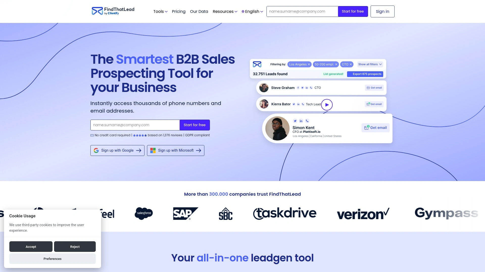

FindThatLead provides versatile B2B contact discovery across multiple platforms. The Chrome extension extracts emails and phone numbers from LinkedIn profiles, Crunchbase, and corporate websites as you browse. You can use LinkedIn search to collect target profiles in bulk, then FindThatLead reveals contact information for entire lists simultaneously.

Define your industry, role, location, or keywords and FindThatLead serves tailored B2B email lists matching your criteria. Already have leads? The platform enriches them by adding missing email addresses. The integrated email campaign features let you roll out targeted B2B outreach directly from FindThatLead.

What makes FindThatLead unique is the AI email copywriting assistant—if you're stuck crafting messages, the AI helps create compelling copy that stands out. Follow-up automation, CRM integrations, and an internal CRM for lead management provide complete workflow support. Users praise its "user-friendly interface" and effectiveness in "locating contacts within specific companies and sectors."

The all-in-one approach means you find leads, enrich data, write outreach, send campaigns, and manage relationships within one platform. For businesses wanting to consolidate multiple tools and reduce subscription costs, FindThatLead delivers comprehensive functionality at accessible pricing.

---

## **[LinkedIn Sales Navigator](https://www.linkedin.com/sales/solutions)**

LinkedIn's native B2B prospecting platform with advanced search filters, InMail credits, and lead recommendations.

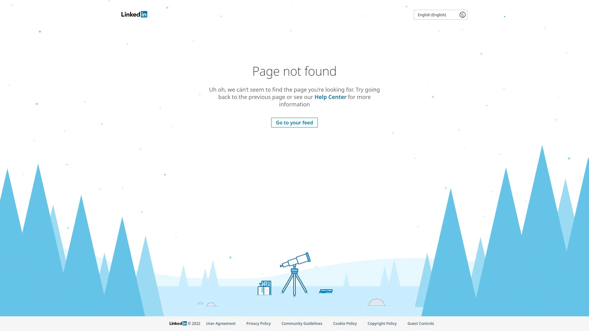

Sales Navigator is LinkedIn's premium tool specifically built for finding, reaching out, and engaging with prospects. It provides significantly more powerful features than standard LinkedIn search, including advanced filters by job title, company size, industry, geography, and seniority level. The platform identifies decision-makers within target accounts and recommends leads based on your preferences.

InMail credits allow direct messaging to prospects outside your network, bypassing connection request limitations. Lead and account recommendations surface prospects matching your search patterns and saved criteria. Sales Navigator integrates with CRM systems, pushing prospect data directly into Salesforce, HubSpot, and other platforms.

Real-time updates notify you when prospects change jobs, get promoted, or share content—creating natural conversation opportunities. TeamLink shows how your colleagues are connected to prospects, enabling warm introductions. Sales Navigator works on both desktop and mobile, letting you prospect from anywhere.

Pricing starts around $99 monthly for the Core plan with more advanced options for teams. The learning curve requires time to master features and filters. For B2B businesses where LinkedIn is central to prospecting strategy, Sales Navigator provides unmatched depth directly from the source platform. The cost justifies itself through superior targeting and native integration with LinkedIn's massive professional network.

---

## **[PhantomBuster](https://phantombuster.com)**

Highly customizable automation extracting prospect data from LinkedIn with workflow "Phantoms" for scalable engagement.

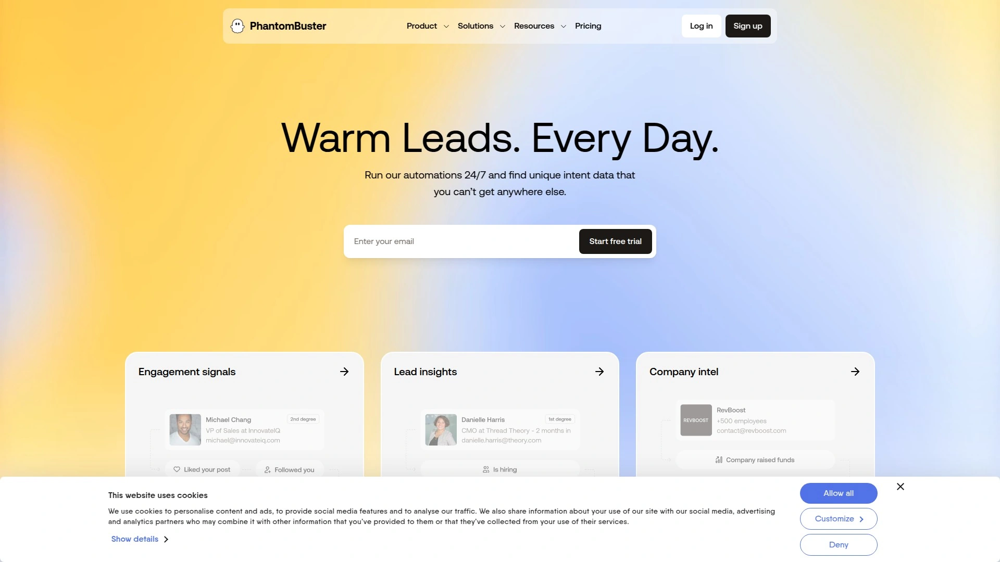

PhantomBuster automates prospecting across LinkedIn and other platforms through customizable "Phantoms"—pre-built automation workflows. The platform extracts prospect data from LinkedIn searches, sends connection requests, automates messaging sequences, and tracks engagement. Installation works on Chrome and Firefox with simple setup.

What sets PhantomBuster apart is extreme customization—you can create complex multi-step automation combining data extraction, enrichment, and outreach. The tool handles not just LinkedIn but also Twitter, Instagram, Facebook, and Google Maps prospecting. PhantomBuster's "Flows" connect multiple Phantoms together, creating sophisticated automation like automatically sending follow-up messages to prospects who accept connection requests.

The platform provides engagement automation for warming leads before sales outreach—automatically tagging prospects on posts to start conversations naturally. PhantomBuster works particularly well for power users comfortable with automation who want maximum control over prospecting workflows.

Pricing starts at $56 monthly with different tiers based on execution time and phantom limits. The learning curve is steeper than plug-and-play tools, but the flexibility rewards investment. For technical sales teams, growth hackers, and agencies managing multiple client campaigns, PhantomBuster delivers automation capabilities far beyond basic contact finders.

---

## **[Dux-Soup](https://www.dux-soup.com)**

LinkedIn automation mimicking human actions with profile visits, endorsements, and message sequences for organic engagement.

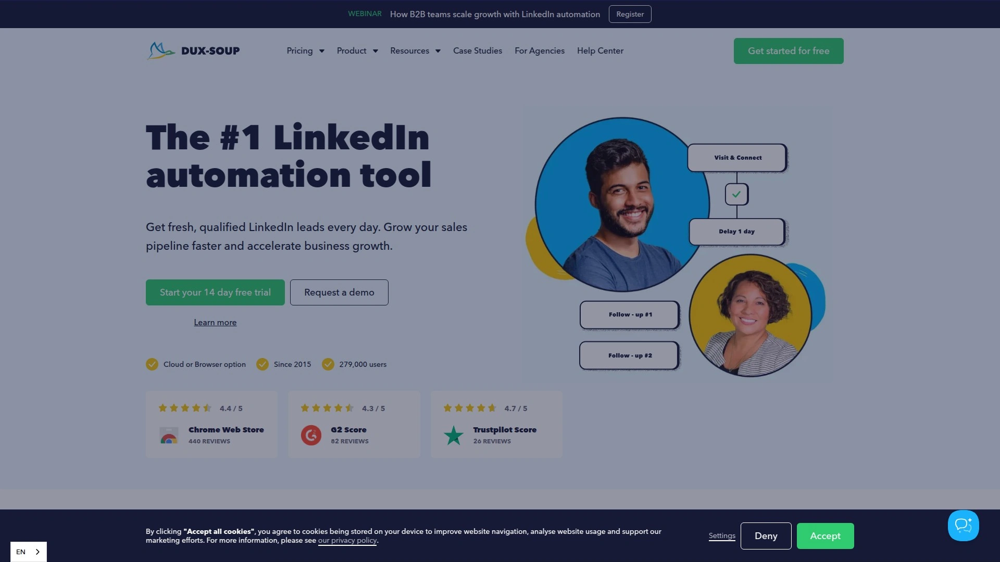

Dux-Soup automates LinkedIn lead generation and engagement activities through human-like behavior patterns. The tool automatically views profiles, follows prospects, endorses skills, and sends connection invites without triggering LinkedIn's anti-spam filters. Dux-Soup works on both LinkedIn Recruiter and Sales Navigator, making it versatile for different subscription levels.

The platform creates campaigns sending personalized messages at scale while randomizing timing to appear natural. Skill endorsements and automated profile interactions warm prospects before connection requests, increasing acceptance rates. Engagement analytics track campaign performance showing views, connections, and response rates.

Dux-Soup is favored for simplicity and affordability compared to enterprise automation platforms. You can easily create prospect lists from LinkedIn searches and let the tool engage automatically. The Chrome extension integrates directly into LinkedIn's interface, requiring minimal setup.

Paid pricing starts at £9.08 per user monthly, positioning it as one of the most affordable automation options. Dux-Soup works best for freelancers, agencies, and small teams wanting to expand outreach without spending hours manually engaging on LinkedIn. The automation saves time while maintaining enough human-like behavior to avoid platform restrictions.

---

## **[Waalaxy](https://www.waalaxy.com)**

French multichannel tool combining LinkedIn messaging automation with cold email sequences and proxy management.

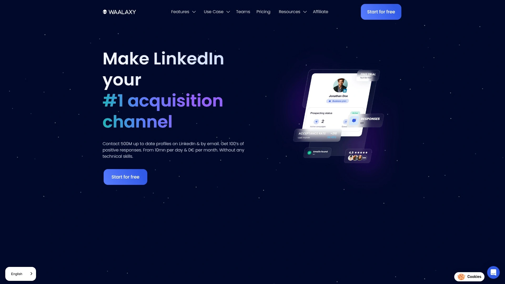

Waalaxy started as LinkedIn messaging automation then evolved into multichannel outreach combining LinkedIn and cold email sequences. The platform seamlessly integrates with LinkedIn, functioning as a powerful extension of your profile. You can access contacts, view profiles, and send connection requests and messages directly through Waalaxy without switching tools.

The proxy management feature allows Waalaxy to work even when your computer is off, running campaigns continuously from their servers. This eliminates the need to keep browsers open or maintain active connections. Multichannel sequences alternate between LinkedIn touchpoints and email follow-ups for comprehensive engagement.

Users praise Waalaxy for being "very easy to implement and start prospecting" with straightforward campaign setup. The platform needs improvement in user interface and cold email functionality independent of LinkedIn campaigns, according to user feedback. Better reporting features are frequently requested enhancements.

Waalaxy targets European markets particularly well, with strong adoption among French and international businesses. For teams running coordinated LinkedIn and email outreach where automation reliability matters more than advanced features, Waalaxy provides dependable execution. The proxy management especially appeals to teams managing multiple LinkedIn accounts or high-volume prospecting.

---

## **[ContactOut](https://contactout.com)**

Specialized recruiter tool with talent sourcing features and LinkedIn profile enrichment for hiring workflows.

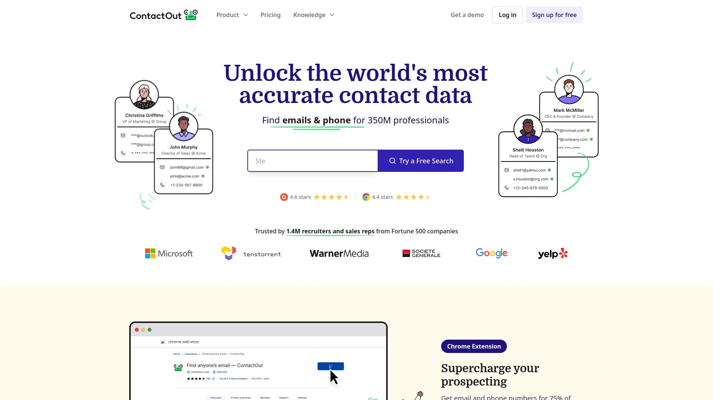

ContactOut focuses on recruiting and talent acquisition, providing verified contact information for candidates on LinkedIn. The Chrome extension makes LinkedIn prospecting effortless, saving leads directly to your ContactOut dashboard. The platform enriches lead data through built-in tools including search by LinkedIn profile links.

ContactOut excels at finding personal email addresses for passive candidates who aren't actively job hunting. This capability is critical for recruiters targeting specialized talent in competitive markets. The platform provides direct contact information bypassing the need for LinkedIn InMail or connection requests.

The tool integrates with applicant tracking systems and recruiting platforms, streamlining candidate pipeline management. ContactOut's free plan offers 40 monthly emails with paid plans beginning at $99 monthly for higher volume needs. The accuracy rates are particularly strong for North American contacts.

For recruiters, hiring managers, and talent acquisition teams, ContactOut delivers specialized functionality beyond general-purpose prospecting tools. The focus on recruiting workflows and candidate-specific data makes it more relevant than sales-focused alternatives. However, sales teams prospecting for clients might find other tools better suited to B2B contact discovery.

---

## **[Voila Norbert](https://www.voilanorbert.com)**

Simple email finder using search engine style interface with name and company domain matching for quick discovery.

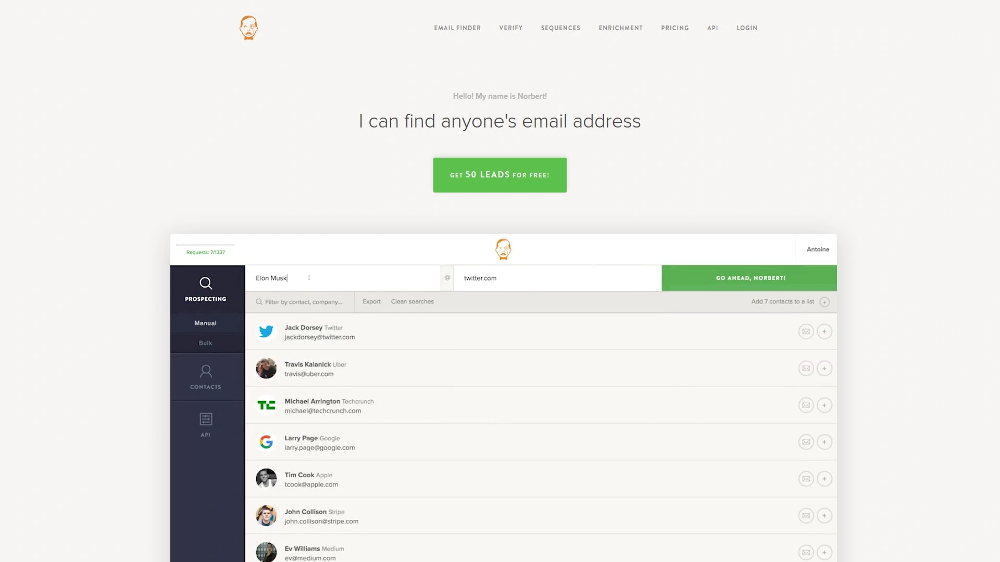

Voila Norbert provides straightforward email finding through a simple search interface. Enter a person's name and company domain, and Norbert locates their email address through pattern matching and verification. The tool focuses specifically on email discovery without attempting to be an all-in-one platform.

The simplicity is Voila Norbert's strength—no complex features to learn, just fast email lookups. The platform verifies emails before returning results, ensuring high deliverability. Bulk search capabilities let you upload CSV files with names and companies, receiving verified emails for entire lists.

Voila Norbert works well for quick one-off searches when you know exactly who you're trying to reach. The Chrome extension adds functionality for finding emails while browsing LinkedIn and company websites. API access allows integration with custom workflows and internal tools.

Pricing is straightforward and affordable compared to comprehensive prospecting suites. For businesses prioritizing simplicity and email-specific needs over multifunctional platforms, Voila Norbert delivers focused value. It pairs well with other tools—use Sales Navigator or PhantomBuster for prospecting, then Voila Norbert specifically for email discovery.

---

## **[Clearout](https://clearout.io)**

LinkedIn email finder Chrome extension with pre-verified contact collection for building ICP-targeted lead lists.

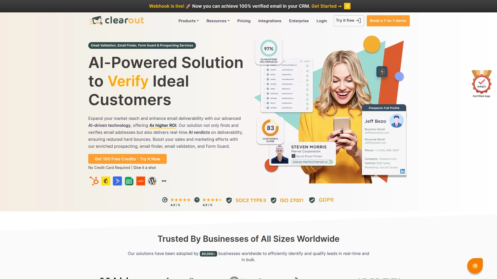

Clearout's LinkedIn Email Finder Chrome Extension specializes in collecting pre-verified contact information from LinkedIn and LinkedIn Sales Navigator. The platform ensures email addresses are validated before adding them to lists, maintaining high data quality from the start. Clearout is ideal for building targeted lead lists of Ideal Customer Profiles with confidence in accuracy.

The focus on pre-verification means you're not discovering contacts only to later find emails bounce. This upfront validation protects sender reputation and saves time on additional verification steps. Clearout seamlessly integrates into LinkedIn browsing, revealing verified emails as you explore profiles.

For businesses with clearly defined ICPs, Clearout streamlines the process of building qualified prospect lists. The tool works particularly well combined with LinkedIn's advanced search—narrow to your exact target audience, then Clearout provides verified contact information for everyone in results.

Pricing starts at competitive rates for the verification and discovery capabilities provided. Clearout works best for quality-focused teams willing to trade breadth of features for depth in email accuracy. If your outreach strategy centers on email and maintaining high deliverability is critical, Clearout's verification-first approach delivers the foundation needed.

---

## **[Overloop](https://overloop.com)**

Sales engagement automation with multi-channel outreach combining LinkedIn and email sequences with analytics tracking.

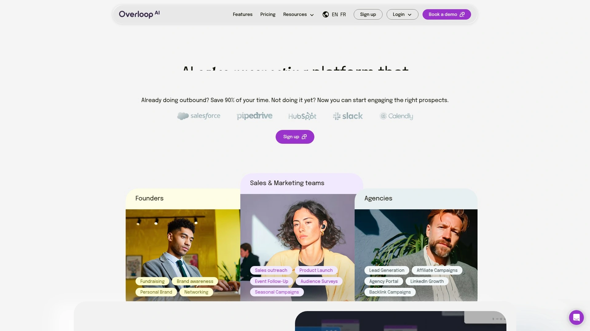

Overloop provides sales engagement automation focused on outbound prospecting through multiple channels. The platform personalizes email sequences at scale while managing workflows efficiently. LinkedIn automation capabilities run alongside email campaigns, creating coordinated multi-touch outreach.

The workflow management features help sales teams organize prospecting activities, track engagement, and measure campaign performance. Analytics show open rates, response rates, and conversion metrics across channels. Overloop integrates with CRM systems, ensuring prospect interactions sync with existing records.

What makes Overloop valuable is treating prospecting holistically rather than as isolated channels. The platform recognizes modern buyers need multiple touchpoints before responding, so it orchestrates LinkedIn and email contacts strategically. Personalization features ensure messages feel relevant despite automation scale.

Overloop targets sales teams expanding outbound prospecting who want automation without losing the human touch. The platform balances efficiency with personalization better than purely automated solutions. For businesses where multi-channel engagement drives pipeline growth, Overloop provides the infrastructure to execute coordinated campaigns consistently.

---

## **[LaGrowthMachine](https://www.lagrowthmachine.com)**

Detailed multichannel sales automation across LinkedIn, email, and Twitter with campaign sequencing for comprehensive outreach.

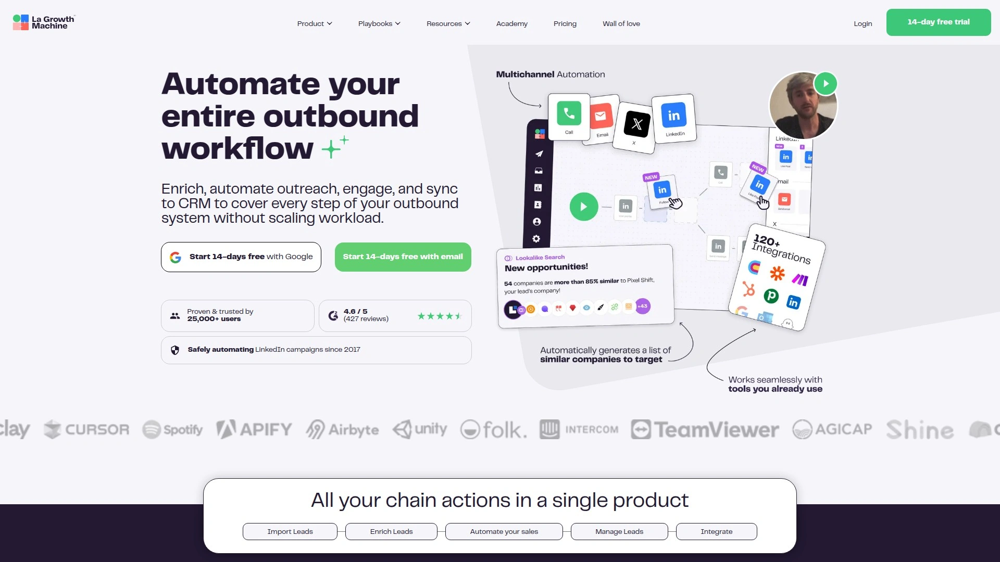

LaGrowthMachine simplifies prospecting across LinkedIn, email, and Twitter through unified automation. The platform builds multi-step sequences combining all three channels, creating comprehensive engagement campaigns. You can design workflows that start with LinkedIn connection requests, follow up via email if unanswered, then engage on Twitter—all automated.

The detailed customization options let you control timing, messaging, and channel prioritization for each campaign. LaGrowthMachine tracks engagement across channels, showing which touchpoints generate responses. The analytics inform future campaign optimization by revealing what works for your audience.
  
Integration with CRM systems ensures prospect data and interactions sync automatically. LaGrowthMachine particularly excels for businesses targeting audiences active across multiple social and communication channels. The coordinated approach increases touchpoints without overwhelming prospects since messages arrive through different mediums.

For sales teams needing multi-channel automation rather than LinkedIn-only tools, LaGrowthMachine delivers comprehensive coverage. The platform works best when you have clear messaging for each channel and understand your audience's preferred communication methods. The investment pays off through higher response rates from diversified outreach strategies.

---

## **FAQ**

**How do I avoid getting my LinkedIn account restricted when using prospecting tools?**

Choose cloud-based tools with dedicated IPs like Expandi or Dripify that mimic human behavior through randomized actions and timing delays. Limit connection requests to 50-100 weekly maximum and avoid sending identical messages. Tools like Dux-Soup and PhantomBuster include built-in safety features preventing spam detection. Maintain natural activity—don't run automation 24/7, and manually engage with content between automated sessions. If using browser-based tools, keep daily limits conservative and vary your prospecting times.

**What's the difference between free and paid plans for contact data tools?**

Free plans typically offer 5-50 credits monthly for testing (like Kaspr's 5 emails and 5 phones, or Hunter's 25 searches), sufficient for occasional prospecting but not regular use. Paid plans provide significantly higher limits (hundreds to unlimited contacts), access to phone numbers alongside emails, CRM integrations, bulk exports, and priority support. Free tiers often lack advanced features like intent data, email verification, and enrichment capabilities. For consistent B2B prospecting, paid plans justify costs through time savings and higher data quality.

**Can I use multiple prospecting tools together, or will that create duplicate efforts?**

Combining complementary tools often works better than relying on one platform. Use Sales Navigator or PhantomBuster for targeted prospect identification, then Kaspr or Hunter for contact extraction, and finally Overloop or LaGrowthMachine for outreach automation. Ensure your CRM deduplicates contacts to prevent multiple outreach to the same person. Many successful teams use a prospecting stack: one tool for research, another for data enrichment, and a third for engagement. The key is clear workflow definition so tools enhance rather than duplicate each other's functions.

---

## **Conclusion**

B2B prospecting no longer requires hours of manual research and data entry. The right tools reveal verified contact information instantly, letting you spend time building relationships instead of hunting for email addresses. Whether you prioritize unlimited emails, phone verification, compliance standards, or multi-channel automation, there's a solution matching your team's specific prospecting workflow.

[Kaspr](https://www.kaspr.io) delivers exceptional value for sales teams prioritizing European contact accuracy and affordability. The free plan provides genuine testing capability, while paid plans offer unlimited B2B emails and seamless CRM integration without enterprise pricing. When you need reliable contact data that actually connects you with decision-makers, Kaspr eliminates guesswork and keeps your pipeline flowing consistently.
